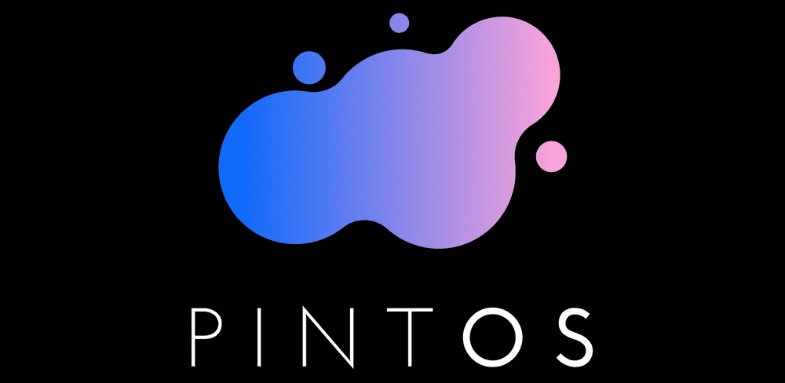

---

# PINTOS 스터디

## Docs
* [Pull Request 하는법](./docs/pr방법.md)

## References
* [pintos(kaist ver.) 소스코드](https://github.com/casys-kaist/pintos-kaist)
* [pintos(kaist ver.) 슬라이드](https://oslab.kaist.ac.kr/pintosslides/)
* [pintos(kaist ver.) 깃북](https://casys-kaist.github.io/pintos-kaist/)
* [pintos(kaist ver.) 교수님 강의자료](https://oslab.kaist.ac.kr/wp-content/uploads/esos_files/courseware/undergraduate/PINTOS/Pintos_all.pdf)
* [pintos(stanford ver.) 메뉴얼](https://web.stanford.edu/class/cs140/projects/pintos/pintos.html#SEC_Top)

## 일정표
|주차|Project|Check|
|--|--|--|
|1주차|Getting start|`진행완료`|
|2주차|Thread|`진행중`|
|3주차| ... || 

## Contributor

---